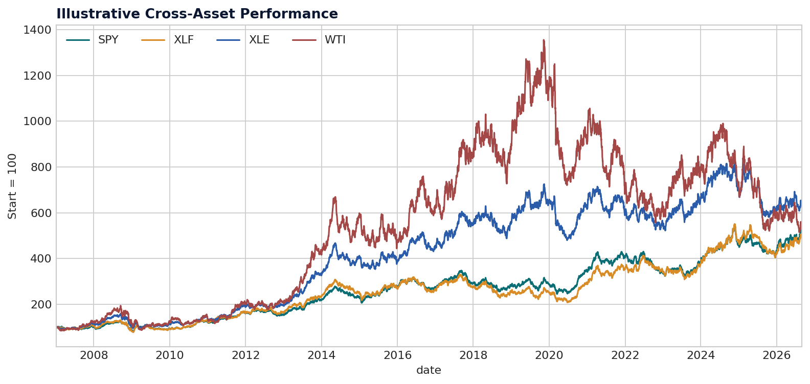

# Market Insighter

> A Python-based macro and cross-asset analytics platform for studying how economic events transmit into equities, rates, commodities, and FX.


[](https://github.com/Huniiiii/Market-Insighter/actions/workflows/tests.yml)


[View the sample market report](reports/sample_market_report.pdf)

Market Insighter is a compact, sell-side-style research tool built to turn market data into reproducible analysis. It combines live data ingestion, rolling cross-asset relationships, macro event studies, portfolio risk, historical stress testing, and transparent rule-based commentary in one Streamlit dashboard.

The bundled demo is fully offline and deterministic, so the project remains usable during an interview even when an API or network is unavailable.



## Research questions

1. What happens to CAD when oil rises sharply?
2. How does USD/KRW react when US Treasury yields rise?
3. Which assets are most sensitive around CPI and central-bank events?
4. How does a multi-asset portfolio behave during the GFC, COVID selloff, and 2022 rates shock?

## What the platform does

| Module | Output | Why it matters |
|---|---|---|
| Data pipeline | FRED macro series, Yahoo Finance market data, offline fallback | Reproducible ingestion with clear source labels |
| Market monitor | Levels and 1D/1W/1M changes | Fast cross-asset snapshot |
| Rolling analytics | 20/60/120/252-day correlation, z-scores, heatmaps | Shows when relationships strengthen or break |
| Event study | -N/+N trading-day paths, average and median moves | Measures asset response around macro events |
| Portfolio risk | Return, volatility, Sharpe, beta, VaR, Expected Shortfall, max drawdown | Connects market views to portfolio outcomes |
| Stress testing | GFC, COVID, and 2022 rates-shock windows | Makes downside risk tangible |
| Commentary | Auditable, rule-based market observations | Produces concise text without invented causality |

## Dashboard

The Streamlit app has five workspaces:

- **Market Overview** - market cards, normalized performance, and desk commentary.
- **Cross-Asset** - pair analysis, rolling correlation, heatmap, and move z-scores.
- **Event Study** - selectable events, assets, and pre/post windows.
- **Portfolio Risk** - editable weights, tail risk, drawdown, stress tests, and component risk.
- **Data Explorer** - inspect and export the exact observations used.

```bash
git clone https://github.com/Huniiiii/Market-Insighter.git
cd Market-Insighter
python -m venv .venv

# macOS/Linux
source .venv/bin/activate

# Windows PowerShell
# .venv\Scripts\Activate.ps1

pip install -r requirements.txt
streamlit run app/streamlit_app.py
```

The app starts in **Demo data** mode; no API key is needed.

## API keys

Only FRED needs a key. Yahoo Finance access through `yfinance` does not.

1. Copy `.env.example` to `.env`.
2. Get a free key from the [FRED API](https://fred.stlouisfed.org/docs/api/api_key.html).
3. Paste it after `FRED_API_KEY=`:

```dotenv
FRED_API_KEY=your_key_here
```

For Streamlit Community Cloud, add `FRED_API_KEY` in the app's **Settings -> Secrets** rather than committing `.env`. The current commentary engine is deterministic and does not use an OpenAI API key.

## Project structure

```text
Market-Insighter/
├── app/                    # Streamlit interface
├── charts/                 # Reproducible sample outputs
├── data/
│   ├── macro/              # User-supplied/downloaded macro data guidance
│   ├── market/             # User-supplied/downloaded market data guidance
│   └── sample/             # Deterministic offline demo data
├── docs/                   # Methodology and data dictionary
├── notebooks/              # Four guided research workflows
├── reports/                # Sample PDF research note
├── scripts/                # Asset generation script
├── src/                    # Reusable analytics library
├── tests/                  # Unit tests
├── .env.example            # Blank API configuration
├── requirements.txt
└── README.md
```

See [Architecture](docs/architecture.md), [Methodology](docs/methodology.md), and the [Data Dictionary](docs/data_dictionary.md) for implementation details.

## Reproduce the sample assets

```bash
python scripts/generate_sample_assets.py
pytest
```

This rebuilds the sample CSV files, three charts, and `reports/sample_market_report.pdf`. The random seed is fixed, so outputs are reproducible.

## Example research interpretation

In the demo data, oil and USD/CAD usually have a negative return correlation. Because USD/CAD is quoted as Canadian dollars per US dollar, a lower pair means a stronger CAD. That sign convention makes the observed relationship economically intuitive: higher oil prices tend to align with CAD strength in an energy-exporting economy.

The tool does **not** claim that correlation proves causality. Event definitions, data frequency, overlapping windows, regime changes, and omitted variables can materially change conclusions.

## Interview-ready talking points

- I separated ingestion, analytics, visualization, and UI so each component can be tested independently.
- I built an offline fallback because a research demo should not depend on live vendor uptime.
- I treat yield changes in basis points and price changes in percent, avoiding a common cross-asset unit error.
- I use a day -1 event-study baseline to isolate the move beginning on the event date.
- I kept commentary deterministic so every sentence can be traced to a calculation.

## Roadmap

- Add verified CPI consensus-surprise data from a licensed provider.
- Add Bank of Canada decisions and Canadian CPI event templates.
- Add expanding-window factor regressions and regime detection.
- Add automated PDF export from the live dashboard.
- Add optional LLM commentary grounded only in calculated outputs.

## Disclaimer

This repository is an educational portfolio project. The bundled data and event calendar are synthetic and illustrative. Live third-party data may be delayed, revised, or incomplete. Nothing here is investment advice.
