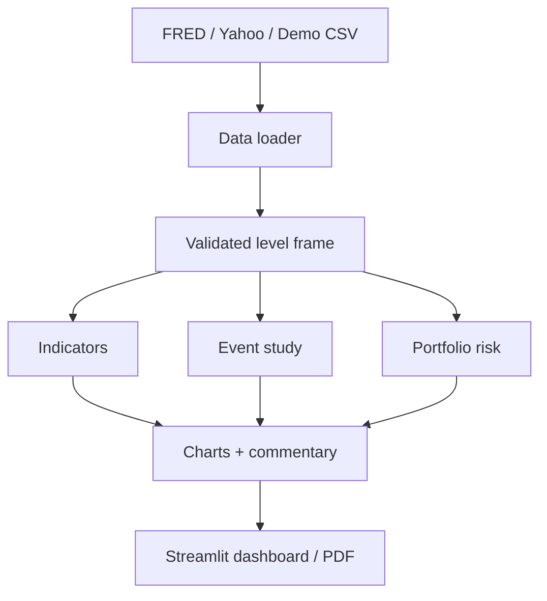

# Architecture

Market Insighter follows a layered design so that data-provider failures do not contaminate analytics and UI logic.

## Design choices

- `src/data_loader.py` returns one `DataBundle` regardless of source.
- `src/indicators.py` handles unit-aware transformations before any correlation is calculated.
- `src/event_study.py` emits long-form results so it can support charts, tables, and exports.
- `src/risk.py` accepts generic price frames and weights, making it reusable outside Streamlit.
- `src/commentary.py` describes calculated facts and avoids unsupported causal claims.
- `app/streamlit_app.py` contains presentation logic only; core calculations stay testable.

## Failure behavior

The live loader preserves partial results if one provider fails. If no live series can load, the app falls back to the deterministic sample dataset and displays the reason. API secrets never appear in source files or logs.

